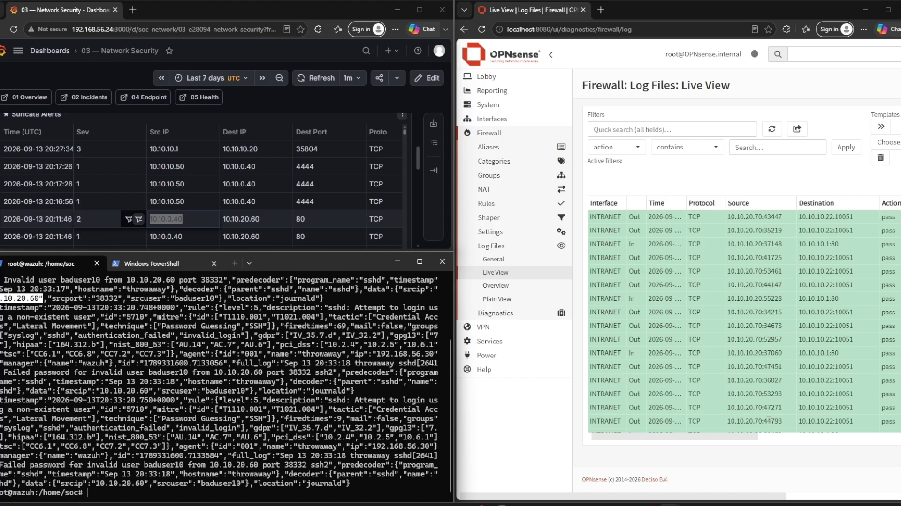
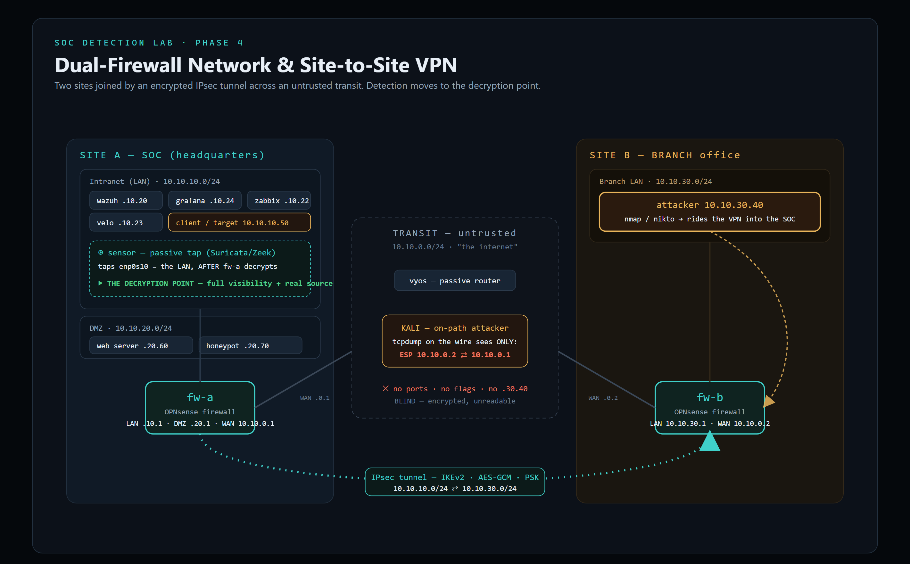
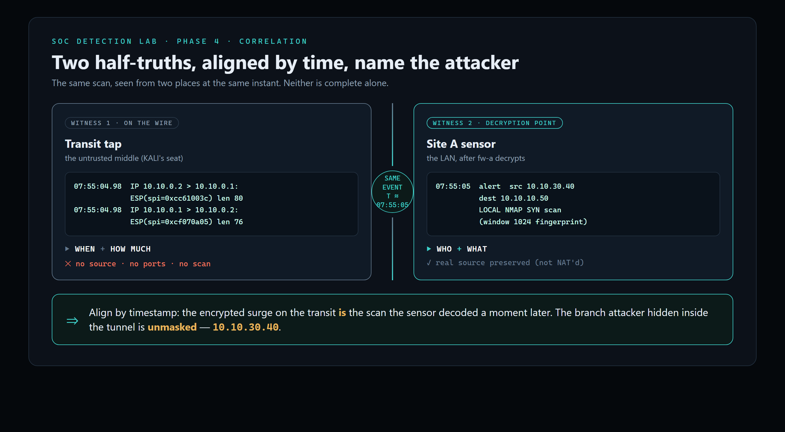

# SOC Detection Lab

A home-built **Security Operations Center** on VirtualBox — built in four phases, each one raising the difficulty of *detecting an attacker* as the network gets more realistic: flat → routed → firewalled/NAT → **encrypted site-to-site VPN**.

Every phase ends the same way: an attack is run end-to-end, the monitoring stack catches it, and the evidence is correlated across multiple sources to name the real attacker. The lab is fully documented — an engineering **report**, a **theory deck**, and a **hands-on implementation runbook** per phase.

> **The through-line:** *Can we see the attack? → across a router? → once a firewall lies with NAT? → once the traffic is encrypted?*

Live monitoring from the lab: Suricata alerts in Grafana (left), Wazuh catching an SSH brute-force on the endpoint (bottom-left), and the OPNsense firewall log (right).

---

## Demo

A short screen-recording of the SOC catching an attack across the monitoring stack: [`assets/soc-demo.mp4`](assets/soc-demo.mp4).
*(GitHub plays it inline when you open the file; the full theory + practical walkthrough videos are recorded per phase and kept out of the repo for size.)*

---

## The four phases

| Phase | Network | The hard question it answers |
|---|---|---|
| **[1 — Foundations](phase-1-foundations/)** | Flat segment | Can the SOC see an attack at all? Sensor placement, the five monitoring planes. |
| **[2 — Routing](phase-2-routing/)** | Two subnets via a router | Does monitoring survive a router hop? (No NAT — every log names the real source.) |
| **[3 — Firewall, DMZ & NAT](phase-3-firewall-dmz-nat/)** | 3-zone DMZ, stateful firewall, Source NAT | When the network *lies* about the source, can the SOC still name the attacker? |
| **[4 — Site-to-Site VPN](phase-4-vpn/)** | Two firewalled sites + encrypted IPsec tunnel | How do you detect an attack you **can't read** on the wire? |

---

## The tech stack

**Network / infrastructure**
- VirtualBox (~11 VMs), Ubuntu 24.04, VyOS (routing/transit), **OPNsense** (stateful firewalls ×2), **IPsec / strongSwan** site-to-site VPN (IKEv2 · AES-GCM · PSK)

**Detection & monitoring (five planes)**
- **Network:** Suricata + Zeek on a passive tap
- **Endpoint / SIEM:** Wazuh (manager + agents), custom decoders & rules
- **Availability:** Zabbix
- **Forensics:** Velociraptor
- **Visualization:** Grafana (OpenSearch + Zabbix datasources)

**Offense (validation)**
- nmap, Nikto, curl-based web exploitation, reverse-shell / pivot scenarios

---

## Phase 4 — the headline

Two sites, each behind its own OPNsense firewall, joined by an **encrypted IPsec tunnel** across an untrusted transit. The thesis: **encryption blinds the middle of the network, so detection moves to the point where the firewall decrypts** — and correlation ties the two views together.

**Proven live, end to end:**
- A branch attacker (`10.10.30.40`) scans the SOC **through the VPN**.
- On the **transit**, the same traffic is only `ESP` between two firewalls — no ports, no flags, no source. Unreadable.
- At the **decryption point** (the Site A sensor), the scan is fully detected and the **real branch source is named** (inter-site tunnel traffic isn't NAT'd).
- **Correlation** aligns the encrypted flow on the wire with the decrypted detection inside the site — unmasking the attacker.

---

## What each phase folder contains

- `*-Report.docx` — the full engineering write-up (analyst voice, figures, verification steps)
- `*-presentation.pdf` — the theory slide deck
- `implementation.txt` — concise build steps
- `implementation-guide.md` *(Phase 4)* — a detailed hands-on runbook with verification gates
- `images/` — topology diagrams and IP tables

---

## Skills demonstrated

Network segmentation & trust modeling · stateful firewall policy (least-privilege, DMZ) · NAT and its effect on attribution · **IPsec site-to-site VPN** design and troubleshooting · IDS/IPS signature writing & tuning (Suricata) · SIEM engineering (Wazuh decoders/rules, log pipelines) · **multi-source alert correlation** · adversary emulation · technical documentation.

---

*Home lab · built and documented by the author as a hands-on SOC engineering portfolio. All addresses are private (RFC 1918) lab ranges; no production systems or real credentials are included. Walkthrough videos are recorded separately and are not stored in this repository.*
