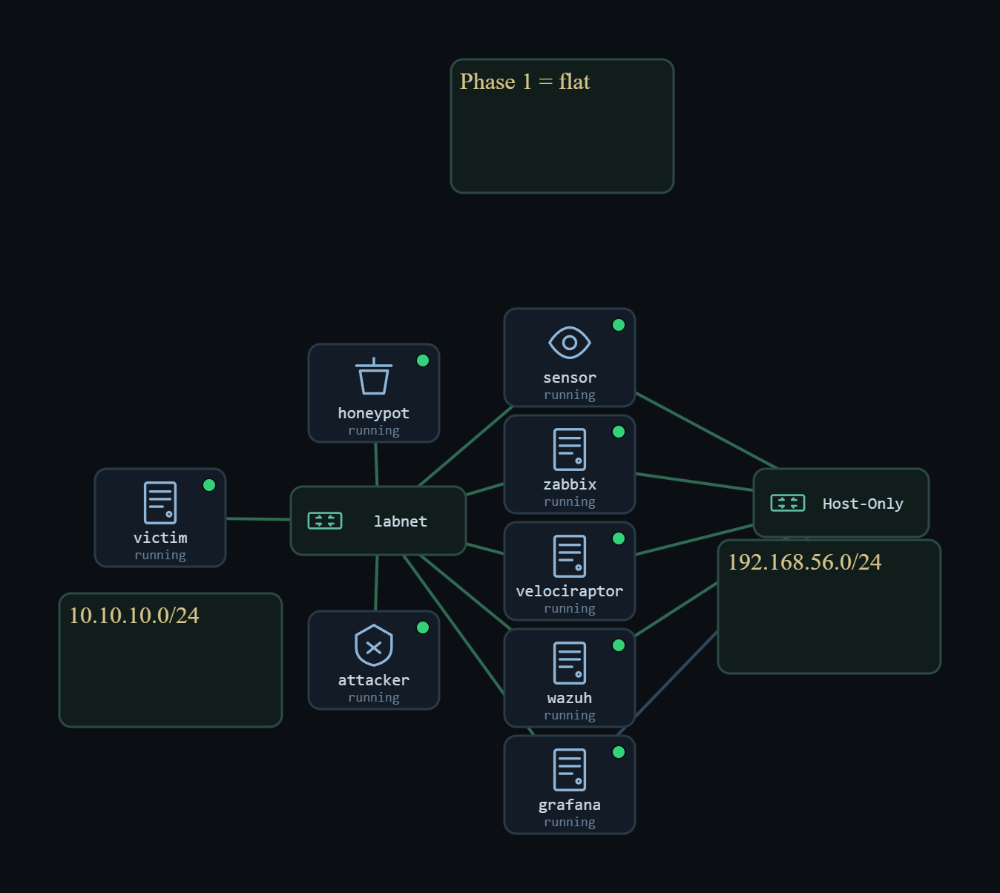
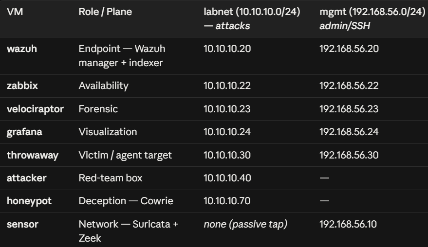

# Phase 1 — Foundations

The starting point: a **single flat network** with the full monitoring stack, built to answer the most basic question — *can the SOC see an attack at all?* This phase stands up the five monitoring planes and proves each one fires on a real attack, with correct sensor placement on a passive tap.

**Focus:** sensor placement · the five planes (network, endpoint, availability, forensics, deception) · baseline detection.

## Contents
- `Phase-1-Report.docx` — full engineering write-up
- `phase1-presentation.pdf` — theory deck
- `implementation.txt` — build steps
