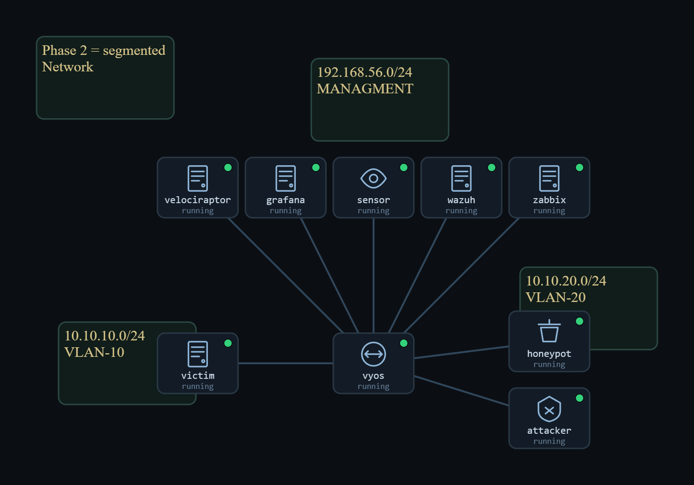
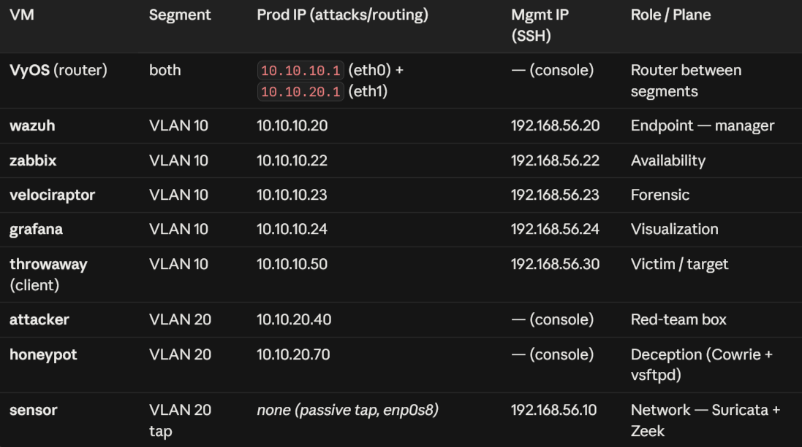

# Phase 2 — Routing

The flat network is split into **two subnets joined by a VyOS router** — with no NAT. The question: *does monitoring survive a router hop?* Because the router only forwards (no address translation), every log still names the real attacker — the clean baseline that Phase 3 will deliberately break.

**Focus:** routed segmentation · monitoring across a Layer-3 hop · attribution while addresses are still honest.

## Contents
- `Phase-2-Report.docx` — full engineering write-up
- `phase2-presentation.pdf` — theory deck
- `implementation.txt` — build steps
