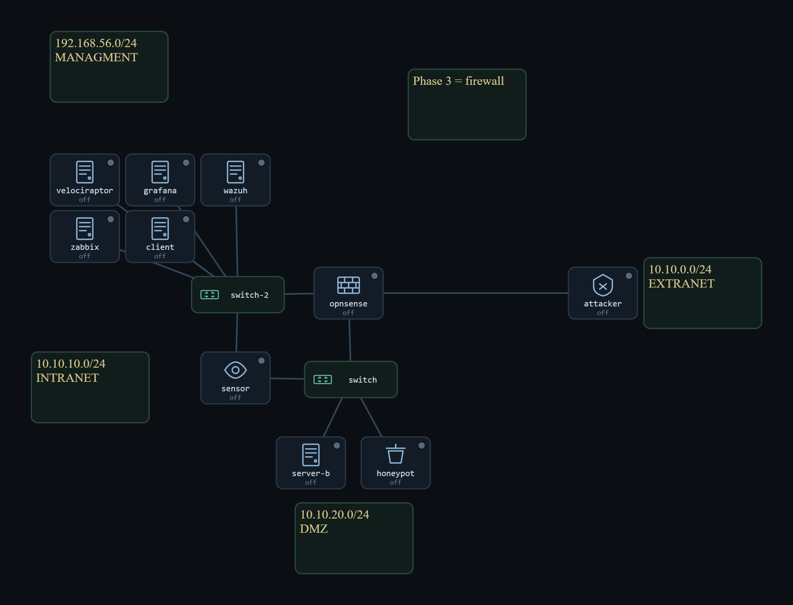
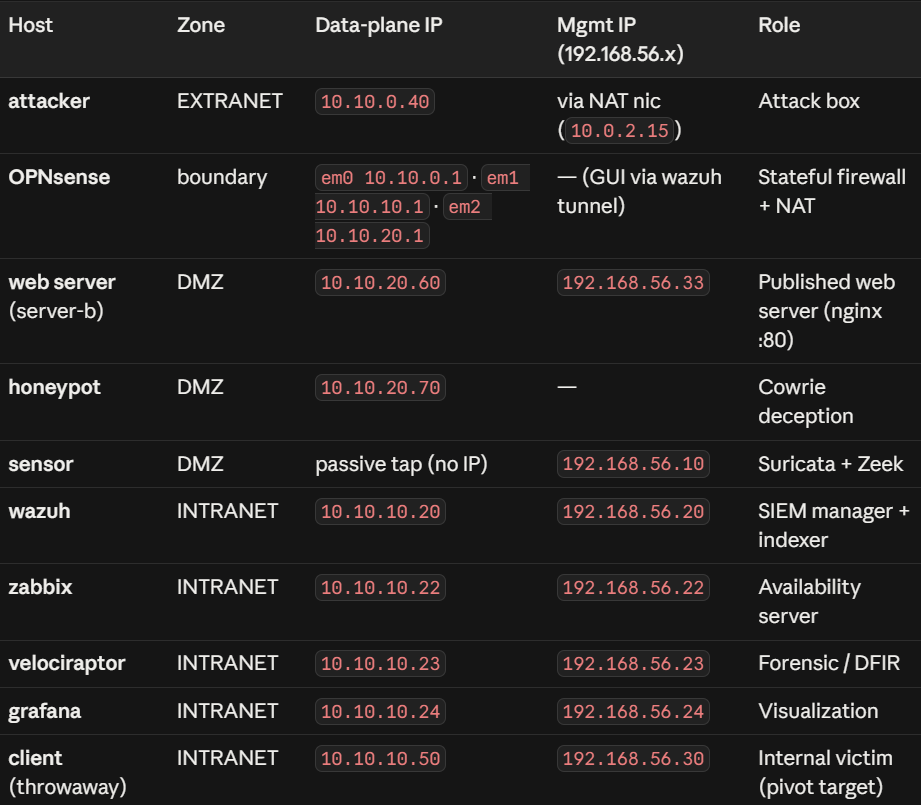

# Phase 3 — Firewall, DMZ & NAT

The router is replaced by an **OPNsense stateful firewall**, the network split into **three trust zones** (Extranet / DMZ / Intranet), with **Source NAT** on egress. NAT and a deliberate pivot path break single-log attribution on purpose — the question becomes: *when the network lies about the source, can the SOC still name the attacker?*

**Focus:** least-privilege zoning · DMZ design · the firewall as a second detection surface · **correlation across sensor, endpoint, and firewall logs** to unmask a pivot.

## Key result
An external scan is filtered at the firewall before it reaches the internal sensor — so detection shifts to the **firewall log** (Wazuh pfSense rules). A reverse shell out of the DMZ is **blocked by egress policy** and logged. A pivot makes the endpoint blame the wrong machine — resolved by correlating three witnesses on one timeline.

## Contents
- `Phase-3-Report.docx` — full engineering write-up
- `phase3-presentation.pdf` — theory deck
- `implementation.txt` — build steps
