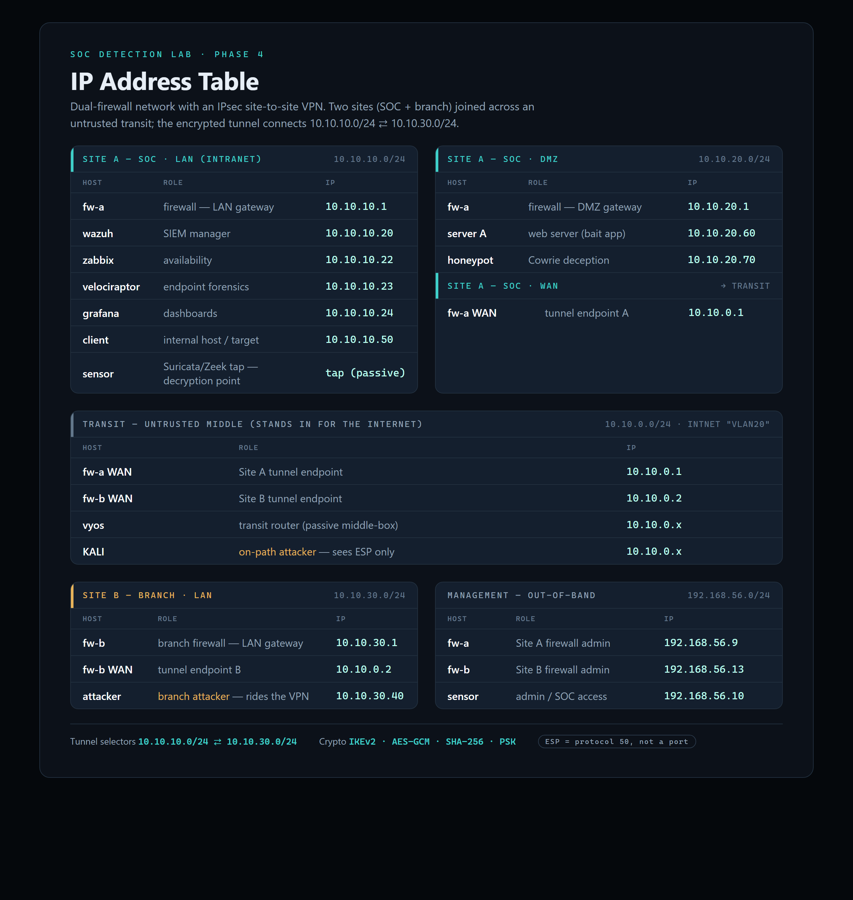

# Phase 4 — Site-to-Site VPN

Two sites, each behind its own **OPNsense firewall**, joined by an **encrypted IPsec site-to-site tunnel** (IKEv2 · AES-GCM · pre-shared key) across an untrusted transit. This is the hardest question in the lab: **how do you detect an attack you can't read on the wire?**

**Thesis:** encryption blinds the middle of the network, so detection **moves to the decryption point** — the LAN behind the firewall, where the traffic is in the clear again — and **correlation** ties the encrypted-flow metadata on the wire to the decrypted detection inside the site.

## What was proven, live and end-to-end

1. **Tunnel** established between `fw-a` (10.10.0.1) and `fw-b` (10.10.0.2), joining `10.10.10.0/24 ⇄ 10.10.30.0/24`.
2. **Connectivity:** a branch host reaches the SOC only through the tunnel (round-trip TTL 62 = two firewalls crossed).
3. **nmap over the VPN** → detected at the Site A sensor, naming the **real branch source `10.10.30.40`** (inter-site tunnel isn't NAT'd, so attribution survives).
4. **Web scan (LFI) over the VPN** → the custom Suricata signature written in Phase 3 fires on the **decrypted** traffic, unchanged.
5. **Blind on the wire:** the same scan captured on the transit shows **only `ESP`** between the two firewalls — no ports, flags, source, or scan pattern.
6. **Correlation:** aligning the two witnesses by timestamp unmasks the branch attacker hidden inside the tunnel.

## IP addressing

See [`ip-table.csv`](ip-table.csv) and the image below.

## Contents
- `Phase-4-Report.docx` — full engineering write-up (analyst voice, figures, verification steps)
- `phase4-presentation.pdf` — 14-slide theory deck
- `implementation.txt` — concise build steps
- `implementation-guide.md` — detailed hands-on runbook (Parts 0–8, with verification gates and the IPsec troubleshooting traps)
- `theory-video-script.txt` / `implementation-video-script.txt` — narration for the walkthrough videos
- `ip-table.csv` · `images/` — addressing and diagrams

## The IPsec gotchas (documented in the guide)
Missing pre-shared-key secret · mirrored remote-ID (each firewall using its own address for both IDs) · WAN "block private networks" dropping IKE · ESP being a protocol (50) not a port · missing host routes to the far LAN · the VM console mangling special characters on paste. Each one stops the tunnel quietly — the runbook shows how to find and fix them.

> Pre-shared keys and other secrets are redacted (`<YOUR-PRE-SHARED-KEY>`). Use your own.
